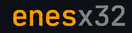

 

Rust developer · Systems programming · Low-level software · Terminal tools

  

 

<table>
<tr>
<td><b>Languages</b></td>
<td>

</td>
</tr>

<tr>
<td><b>Tools</b></td>
<td>

</td>
</tr>
</table>

 

Mostly Rust and C++. Python for small scripts, Assembly for experimentation.

 

# Current Project
* **Rebuilding common GUIs as TUIs using only Win32 and the Rust standard library.**
  
* Notepad / Text Editor: https://github.com/enesx32/Tidy-2.0 or https://github.com/enesx32/Tidy *If you want the older version*

## `> about`

I'm interested in **systems programming, low-level software, terminal applications, and computer architecture**.

Most of what I build starts with a simple question:

> *"How does this actually work underneath?"*

That usually turns into a project.

